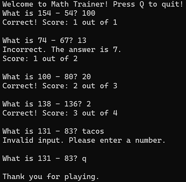

# Math Trainer

I created this short Python program because I was unable to find a simple free app that just gave you one math problem after another. In order to better practice subnetting I needed to be faster at doing basic arithmetic in my head, specifically subtraction problems with numbers up to 255.

I added basic input validation, a loop that keeps giving you questions, a score tracker, and an option to quit at any time. I also added a function that swaps the numbers when num1 is smaller than num2, to prevent cases where the answer would be negative. I am thinking of adding options to include random binary math problems at a later time.

